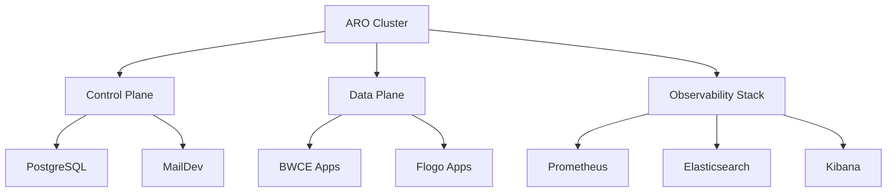
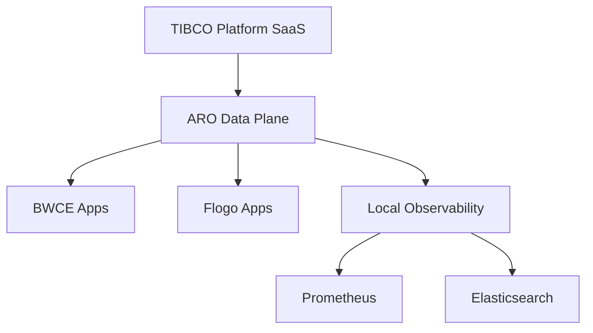
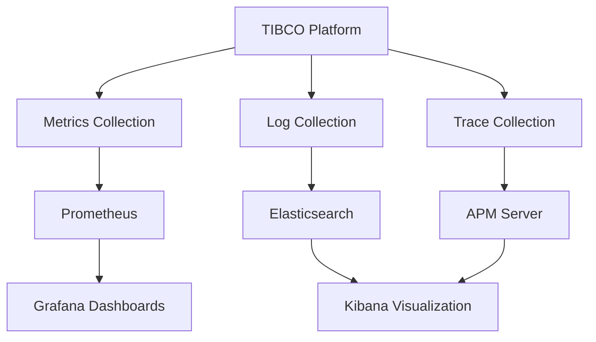

# TIBCO Platform on Azure Red Hat OpenShift (ARO) Workshop

This repository provides comprehensive guides and resources for deploying **TIBCO Platform** on **Azure Red Hat OpenShift (ARO)** clusters. It covers multiple deployment scenarios from basic ARO cluster setup to full Control Plane and Data Plane deployments with observability.

## 🔗 Additional Resources

- [TIBCO Platform Official Documentation](https://docs.tibco.com/pub/platform-cp/latest/doc/html/Default.htm)
- [Azure Red Hat OpenShift Documentation](https://docs.microsoft.com/en-us/azure/openshift/)
- [OpenShift Container Platform Documentation](https://docs.openshift.com/)
- [Elastic Cloud on Kubernetes (ECK)](https://www.elastic.co/guide/en/cloud-on-k8s/current/index.html)
- [Prometheus Operator Documentation](https://prometheus-operator.dev/)

## 🚀 What This Repository Helps You Setup

### 1. **TIBCO Platform Control Plane (CP) + Data Plane (DP) on Same ARO Cluster**
Deploy a complete TIBCO Platform environment with both Control Plane and Data Plane on a single ARO cluster for evaluation and workshop purposes.

### 2. **TIBCO Platform SaaS Control Plane + ARO Data Plane**
Connect an ARO-based Data Plane to an existing TIBCO Platform SaaS Control Plane for hybrid cloud deployments.

### 3. **Observability Setup for CP/DP**
Configure comprehensive monitoring and logging using Prometheus and Elastic Stack (ECK) for both Control Plane and Data Plane deployments.

## 📚 Documentation Structure

### 🏗️ Complete Setup Guides

#### [📖 How to Set Up ARO Cluster with Control Plane and Data Plane](./howto/how-to-cp-and-dp-openshift-aro-aks-setup-guide.md)
**Comprehensive guide for complete TIBCO Platform deployment**
- 🎯 **Scope**: ARO cluster creation + Control Plane + Data Plane on same cluster
- 🔧 **Features**: 
  - Azure environment preparation and ARO cluster creation
  - PostgreSQL and MailDev setup for Control Plane
  - Security Context Constraints and storage configuration
  - Wildcard DNS and certificate management
  - Complete Control Plane and Data Plane deployment
  - Admin user setup and initial password retrieval
- 📋 **Use Case**: Workshop environments, evaluation setups, complete standalone deployments
- ⏱️ **Duration**: 3-4 hours for complete setup

#### [📖 How to Set Up ARO Cluster for Data Plane Only](./howto/how-to-dp-openshift-aro-aks-setup-guide.md)
**Streamlined guide for Data Plane-only deployments**
- 🎯 **Scope**: ARO cluster creation + Data Plane only (connects to SaaS Control Plane)
- 🔧 **Features**:
  - Simplified ARO cluster setup
  - Data Plane specific configurations
  - Connection to existing TIBCO Platform SaaS Control Plane
  - Capability provisioning (BWCE, Flogo)
- 📋 **Use Case**: Connecting to SaaS Control Plane, edge deployments, regional data planes
- ⏱️ **Duration**: 1-2 hours

### 🔍 Observability Setup

#### [📖 How to Install Observability for Data Plane](./howto/how-to-dp-openshift-observability.md)
**Complete observability stack setup for TIBCO Platform**
- 🎯 **Scope**: Elastic ECK + Prometheus + Grafana for monitoring and logging
- 🔧 **Features**:
  - Elastic Cloud on Kubernetes (ECK) operator installation
  - Elasticsearch, Kibana, and APM Server configuration
  - Prometheus and Grafana deployment
  - TIBCO Platform metrics and logs integration
  - Performance monitoring and alerting
- 📋 **Use Case**: Production monitoring, troubleshooting, performance analysis
- ⏱️ **Duration**: 1-2 hours

### 🌐 DNS and Networking

#### [📖 How to Add DNS Records for ARO Routes](./howto/how-to-add-dns-records-aro-azure.md)
**DNS management for TIBCO Platform services**
- 🎯 **Scope**: Azure DNS configuration for ARO ingress routing
- 🔧 **Features**:
  - Wildcard DNS strategy for TIBCO Platform
  - Azure CLI and Portal methods for DNS record creation
  - External DNS automation setup
  - Certificate and DNS alignment best practices
- 📋 **Use Case**: Custom domain setup, SSL certificate management, service discovery
- ⏱️ **Duration**: 30-60 minutes

### ⚙️ Configuration and Scripts

#### [📄 Environment Variables Script](./howto/aks-aro-openshift-env-variables.sh)
**Centralized environment configuration**
- 🎯 **Scope**: All required environment variables for TIBCO Platform deployment
- 🔧 **Features**:
  - Azure and ARO cluster variables
  - TIBCO Platform specific configurations
  - DNS and certificate settings
  - Container registry and Helm chart configurations
- 📋 **Use Case**: Quick environment setup, variable standardization, deployment automation

## 🎯 Deployment Scenarios

### Scenario 1: Complete TIBCO Platform on ARO

**Use this for:**
- ✅ Workshop and evaluation environments
- ✅ Complete standalone TIBCO Platform deployments
- ✅ Development and testing environments
- ✅ Proof of concepts and demos

**Follow:** [Complete Setup Guide](./howto/how-to-cp-and-dp-openshift-aro-aks-setup-guide.md)

### Scenario 2: ARO Data Plane Connected to SaaS Control Plane

**Use this for:**
- ✅ Hybrid cloud deployments
- ✅ Edge computing scenarios
- ✅ Regional data plane deployments
- ✅ Connecting to existing SaaS Control Plane

**Follow:** [Data Plane Only Guide](./howto/how-to-dp-openshift-aro-aks-setup-guide.md)

### Scenario 3: Enhanced Observability Setup

**Use this for:**
- ✅ Production monitoring and alerting
- ✅ Performance analysis and optimization
- ✅ Troubleshooting and diagnostics
- ✅ Compliance and audit requirements

**Follow:** [Observability Setup Guide](./howto/how-to-dp-openshift-observability.md)

## 🛠️ Architecture Overview

### Control Plane Components
- **Platform Bootstrap**: Core platform services and operators
- **Platform Base**: Main Control Plane services (IDM, orchestrator, web server)
- **Integration Capabilities**: BWCE and Flogo integration services
- **Observability**: Built-in monitoring and alerting

### Data Plane Components
- **Core Infrastructure**: Runtime environment for applications
- **Capability Provisioning**: BWCE, Flogo, and other runtime capabilities
- **Observability Integration**: Metrics, logs, and traces collection
- **Hybrid Connectivity**: Secure connection to Control Plane

### Shared Infrastructure
- **ARO Cluster**: Azure Red Hat OpenShift cluster
- **Storage Classes**: Azure Files and Disk storage integration
- **Ingress Controller**: OpenShift router with wildcard domain support
- **DNS Management**: Azure DNS with wildcard entries
- **Certificate Management**: Let's Encrypt integration

## 🤝 Contributing

We welcome contributions to improve these guides and add new deployment scenarios. Please:

1. Fork the repository
2. Create a feature branch
3. Make your improvements
4. Test the documentation with actual deployments
5. Submit a pull request with detailed description

## 📄 License

This project is licensed under the terms specified in the LICENSE file.

---

> **Note**: This repository contains actual steps and configurations used in real deployments. All examples use production-like configurations but should be adapted for your specific environment and security requirements.
